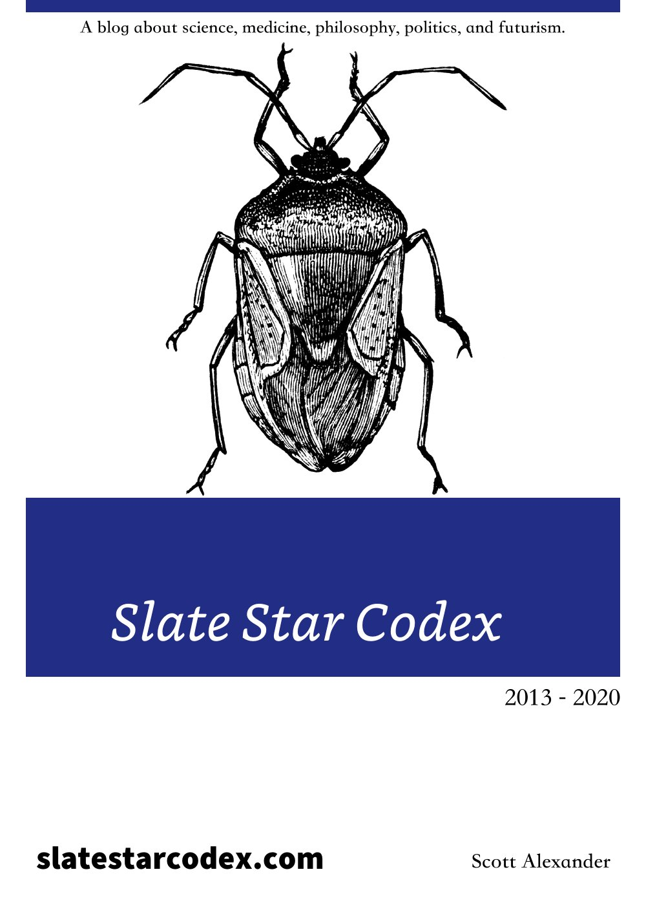
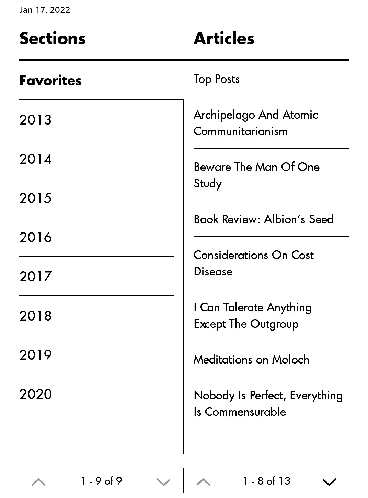
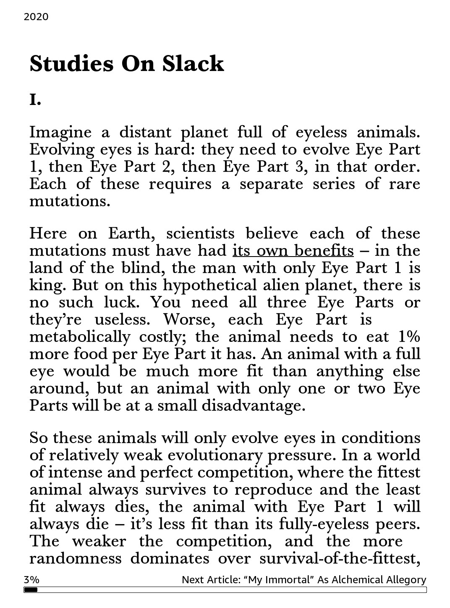

# Slate Star Codex

Vitalik Buterin曾在2019年**晚点 LatePost**的一个访谈[对话以太坊创始人V神](https://www.latepost.com/news/dj_detail?id=119)中高度赞扬这个博客，他说：***最近读的一个博客—Slate star CodeX，信息量很大，像读了5本书的感觉。***

我发现在Twitter上，除了Vitalik Buterin之外，Paul Graham和Elon Musk也关注了博客的作者[Scott Alexander](https://twitter.com/slatestarcodex)。

我只看了两篇长文(**TL;DR**)，考虑到这些年人们常谈到“内卷”和"躺平"，我感觉很多人应该都对这两篇文章感兴趣。

 - [Meditations On Moloch](https://slatestarcodex.com/2014/07/30/meditations-on-moloch/)
 - [Studies On Slack](https://slatestarcodex.com/2020/05/12/studies-on-slack/)

引用**Studies On Slack**中的一句话，“在密教中，完全竞争被称为 Moloch，完全没有竞争被称为 Slack”。

>In the esoteric teachings, total competition is called Moloch, and total absence of competition is called Slack.

整个博客有超过1500篇文章，我在制作电子书时，使用正则表达式过滤了标题中包含`Open Thread #`和`Links for #date#`之类的文章，剩余的900多篇文章全部收录在内。制作电子书用时90分钟。

## Reference

 - [Slate Star Codex](https://slatestarcodex.com)
 - [Kindle 版电子书](https://t.me/master_thyself/330)
